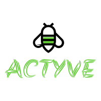

# ACTYVE

ACTYVE is an activity tracking app built with Ruby on Rails.

[

## Description

Actyve is a personal activity tracker application. A User can sign up to record their activities,
with different types of exercises included and get an overall summary of their total workouts. If
an exercise type is not available, a User can also create a new one.

Users will also be able to see activities posted by other Users.

## Installation

Clone the repository:

[https://github.com/rayvaldez/actyve](https://github.com/rayvaldez/actyve)

And then execute:

    $ rails s

## Usage

Create an account and click on "Post an activity". You will then select a type of exercise,
and then on the following page, provide the details of your activity.

## Contributing

Bug reports and pull requests are welcome on GitHub at https://github.com/rayvaldez/actyve. This project is intended to be a safe, welcoming space for collaboration, and contributors are expected to adhere to the [Contributor Covenant](http://contributor-covenant.org) code of conduct.

## License

The repository is available as open source under the terms of the [MIT License](https://opensource.org/licenses/MIT).

## Code of Conduct

Everyone interacting in the 'actyve' project’s codebases, issue trackers, chat rooms and mailing lists is expected to follow the [code of conduct](https://github.com/rayvaldez/actyve/CODE_OF_CONDUCT.md).
